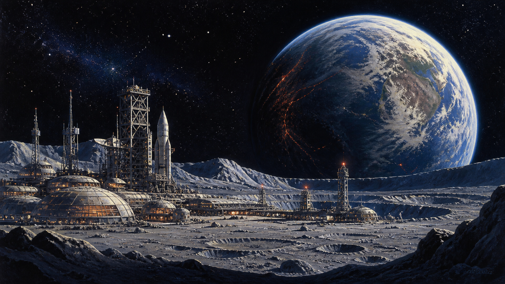
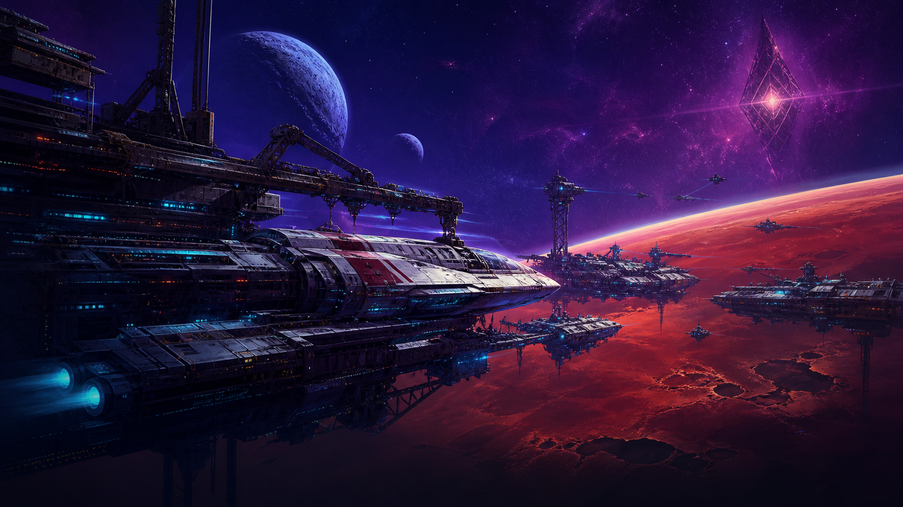

# Project Eon

Project Eon is an open-source, cross-platform reimplementation of Ian Bird's
science-fiction strategy games **Millennium 2.2: Return to Earth** (1989) and
**Deuteros: The Next Millennium** (1991).

| Millennium 2.2 | Deuteros |
| :---: | :---: |
| [](assets/cards/millennium.png) | [](assets/cards/deuteros.png) |

The goal is to make both games fully playable from legally obtained original
game data while preserving their rules and atmosphere. The target architecture
is one deterministic game simulation with two interchangeable presentation
modes; recovered paths are added only when original media evidence supports
them:

- **Original** — authentic artwork, sound, layout, timing and behaviour.
- **Modern** — high-resolution graphics, scalable UI, modern input and
  accessibility improvements without changing the underlying game.

Presentation mode must be switchable without restarting a game or converting
its state.

## Original game data

Project Eon does not distribute commercial game files. Players provide their
own disk images or installed data. The importer fingerprints files and decodes
platform-specific containers into one canonical resource model.

| Game | DOS | Amiga | Atari ST |
| --- | :---: | :---: | :---: |
| Millennium 2.2 | Supported target | Supported target | Supported target |
| Deuteros | — | Supported target | Supported target |

The research corpus currently includes English releases on every platform in
the table and a Spanish DOS floppy release of Millennium 2.2. It also contains
alternate disk dumps; these are identified by content hashes rather than by
their often inconsistent filenames.

## Project goals

- Reproduce the complete campaigns, simulation rules, AI and progression of
  both games—not merely their opening screens.
- Load all supplied DOS, Amiga and Atari ST data variants through tested,
  read-only importers.
- Match reference captures in Original mode, including graphics, audio, input,
  interface layout and timing.
- Provide a polished Modern mode while keeping gameplay and saved state
  identical between renderers.
- Support deterministic, versioned saves and migrate imported original saves
  where their formats can be verified.
- Run on current desktop operating systems without requiring the original
  hardware or an external emulator.
- Document the reverse-engineered formats and behaviour without committing or
  redistributing copyrighted assets.

## Architecture

```text
DOS / Amiga / Atari ST data
            │
      platform importers
            │
 canonical assets + recovered state
            │
 deterministic simulation (as recovered)
       ┌────┴────┐
 original UI   modern UI
```

The native runtime uses **C++20 and SDL3**. SDL supplies windows, rendering,
audio, keyboard/mouse/gamepad input and OS integration; decoded resources and
the deterministic simulation remain independent of SDL.

## Native build

SDL3 and CMake are required. SDL3_image 3.4.4 is fetched automatically when a
system package is unavailable.

```sh
cmake -S . -B build -G Ninja \
  -DEON_REAL_DATA_DIR="$HOME/Hämtningar"
cmake --build build
ctest --test-dir build --output-on-failure
```

Start the graphical card menu:

```sh
./build/project-eon
```

In the card menu, Left/Right selects a game and Up/Down selects one of that
game's hash-verified original platforms. The selected platform is carried into
the launch request: the menu never substitutes a different platform's media.
Enter, Space, or a card click starts the selected original release.

### Language

The launcher UI is translated through the portable gettext-style catalogs in
[`po/`](po/README.md). It currently ships Arabic, German, Greek, British
English, Spanish, Finnish, French, Hindi, Italian, Japanese, Korean, Dutch,
Norwegian, Polish, Brazilian Portuguese, Russian, Swedish, Turkish, Ukrainian,
and Simplified Chinese. Select a launcher language with `--language sv` (or
`-l sv`); without it, Project Eon follows `LC_ALL`, `LC_MESSAGES`, then `LANG`.
Only Project Eon's own UI is translated—original game text remains sourced from
the selected original media.

By default, Project Eon reads user-supplied media from `~/.projecteon` on
Linux/macOS and `<install directory>\data` on Windows. `--data` selects a
different directory or one original archive, for example a preservation
collection in `Hämtningar`.
Archives and disk images are read in place: Project Eon never creates the data
directory, unpacks, copies,
installs, modifies, or redistributes original game data.

The verified Spanish Millennium DOS floppy is supported directly from its
FAT12 image: its original `TITLE.LIB` P00 title and palette are rendered in
place. Its executable hand-off is deliberately kept separate from the
recovered English DOS path until that Spanish ABI has evidence.

Or select a game directly from the CLI:

```sh
./build/project-eon --data "$HOME/Hämtningar" --game millennium \
  --platform amiga --presentation original
./build/project-eon --data "$HOME/Hämtningar" --game deuteros \
  --presentation modern
```

Verify genuine release archives by SHA-256 without opening SDL:

```sh
./build/project-eon --data "$HOME/Hämtningar" --verify-data millennium
./build/project-eon --data "$HOME/Hämtningar" --verify-data deuteros
```

Inspect every recognised original release in one read-only scan:

```sh
./build/project-eon --data "$HOME/Hämtningar" --inspect
```

`--inspect` reports each detected game/platform archive and its recovered
preservation evidence directly from the supplied media. It neither extracts
files to disk nor creates, alters, or substitutes game data.

The current SDL application is deliberately an incremental reimplementation,
not a mock game. It lists detected real releases and proves the Original/Modern
presentation boundary while reverse engineering proceeds. Selecting Deuteros
now runs the recovered Amiga opening channel program live at runtime from the
verified ADF, with its original RGB4 palette, VBL random source and recovered
held input signal. It never substitutes placeholder art or invented game behaviour
for undecoded original data.

`--game deuteros --platform amiga` selects that verified Amiga opening. An
explicit `--platform atari-st` creates the bounded Replicants Disk 1 raw boot
session: it verifies the two original boot-stage ranges in memory and stops
before XBIOS/callback behavior or state selection. It never falls back to
Amiga artwork, audio, or a synthetic ST session while Atari presentation/runtime
parity remains unrecovered.

The launcher follows the same broad structure as OpenCaptive: a native SDL3
start menu, separate game cards, direct CLI game selection, a platform-neutral
data layer and distinct engine/render/audio modules as those systems mature.
The two menu cards are newly generated Project Eon artwork inspired by the
games' broad lunar-recovery and orbital-expansion themes. They contain no
extracted game assets and are never used inside Original mode.

## Current status and research workflow

Project Eon is in the reverse-engineering and foundation phase. It is not yet a
complete playable replacement. The native runtime now verifies the six supplied
release archives by SHA-256, recursively reads nested ZIPs, validates Deflate
streams and CRCs, and fingerprints all 67 contained assets. The verified corpus
contains 17 Amiga ADF images, 18 Atari ST images and both English and Spanish
DOS data for Millennium 2.2.

The Spanish Millennium floppy is now opened as a native FAT12 filesystem. Its
39 genuine root files can be listed and read through validated cluster chains;
integration tests lock the extracted `2200AD.EXE` and `GX.LIB` contents to
their observed SHA-256 hashes.

Its own `TITLE.LIB` is also read directly from that image: `P00` decodes as
the original 320×200 indexed title with the Spanish release's own RGB6 DAC and
logical translation (its final RGBA frame is separately hash-locked). The
Spanish `2200AD4.BIN` celestial display table starts at its observed `$03db`
offset and is exposed byte-for-byte, including `Tierra ` and `Asteroides `.
`--verify-data millennium` reports these FAT12-derived facts without copying
or unpacking the disk. The Spanish title-to-game launcher boundary remains
unmodelled: this release supplies a batch launcher rather than the verified
English `MILL.COM` flow, so Project Eon does not infer a replacement hand-off.

The English DOS `TITLE.LIB` and `GX.LIB` are also parsed natively through their
verified banked resource directory, exposing 38 title resources and 180
gameplay resources directly from the hash-identified original archive.
`TITLE.LIB` resource `P00` now decodes into its authentic 320×200 indexed title
image and its original 256-entry VGA RGB6 DAC table plus 36-entry logical
index translation. The SDL launch view shows this user-supplied original title:
nearest-neighbour in Original mode and linear scaling only in Modern mode.
When its recovered DOS console poll observes a key, the same launch view follows
the verified `TITLES.EXE` → `MILL.COM` → `2200ad.exe` boundary and displays the
in-place `GX.LIB` `IMG00`/`IMG01` canvas. This is intentionally labelled as a
canvas: Project Eon has not yet inferred the original game's full UI or mutable
state semantics from those resources.

After that same verified hand-off, the launcher also presents the original
English DOS `2200SAVE.I` as a read-only evidence panel: its complete SHA-256,
format version, and the 38 recovered positional four-word records. The panel
is paged with Left/Right, uses only `+00`, `+04`, `+06`, and `+08` labels from
the load code, and has no save, export, or inferred simulation action.

The same FAT12 reader is validated against the genuine 819,200-byte Atari ST
Millennium disk. Nested extraction locates the disk by SHA-256 independently of
its filename and reads its 13 root files, including verified `DATA12.BIN`.

Millennium's Amiga media is now distinguished from those filesystem variants:
the verified Defjam ADF boot chain loads a 1 KiB first stage and then two
authentic raw disk ranges (`0x24200`/`0x6e000` to `0x41000`, and
`0x16400`/`0x2c000` to `0x68000`). Project Eon validates this original 68000
request sequence directly from the in-place ADF; it does not invent files or
unpack the ranges. Selecting Millennium Amiga creates this hash-locked bounded
session and validates its resident entry, but stops before the original
transformed-stage call rather than inferring an Amiga game loop.

Deuteros' clean Amiga system and data disks are also opened natively as ADF.
Geometry, boot identifiers, carry-around checksums and arbitrary sectors are
validated against the real images. The 68000 bootloader's decoded-track request is
documented in [the generated disassembly](docs/generated/deuteros-amiga-boot.md).
Both discovered four-bitplane RLE layouts are implemented, covering all 216
bitmap records in the first two resource bundles. The SDL launch view exercises
the same importer, channel VM, compositor, original palettes, VBL tick
sequence, and recovered input gate. It freezes at the first still-unimplemented stateful
save/restore boundary rather than fabricating later animation frames.

After the verified held-input route reaches its original `$0f` handoff, the
runtime also opens the original Amiga title-stage track range read-only and
reports its exact provenance and SHA-256. It deliberately does not render a
guessed title menu or execute through the unrecovered Exec/graphics state.

The repository does not contain the commercial games. Point the inventory tool
at a directory containing the original archives:

```sh
python3 -m eon.inventory ~/Hämtningar
python3 -m unittest discover -s tests -v
```

The generated manifest is the reproducible starting point for disassembly,
resource decoding and cross-platform comparison. Original data paths are
ignored by Git.

See [docs/research.md](docs/research.md) for the reverse-engineering method and
current findings. The hash ledger, evidence levels, reproduction procedure,
and contribution rules live in the
[preservation record](docs/PRESERVATION.md).

## Continuous integration and Git policy

GitHub Actions builds and tests Linux, macOS, and Windows, runs the preservation
tool tests without commercial game data, and scans the complete Git history
with Gitleaks. CI also produces non-published test artifacts: `.deb` and
`.rpm` packages, separate macOS arm64 and x86_64 app bundles, a Windows Inno
Setup installer, and an arm64 iPadOS `.ipa`. The iPadOS artifact is unsigned
for sideload signing with the user's own certificate and provisioning profile.
Packages contain Project Eon only—never original game media. CI has read-only
repository permission and cannot release, tag, or
publish. Development pushes go directly to GitHub `main`; Project Eon does not
create GitHub branches. Releases are made only when the maintainer explicitly
requests one.

## Repository

Development lives at <https://github.com/yeager/project-eon>.
